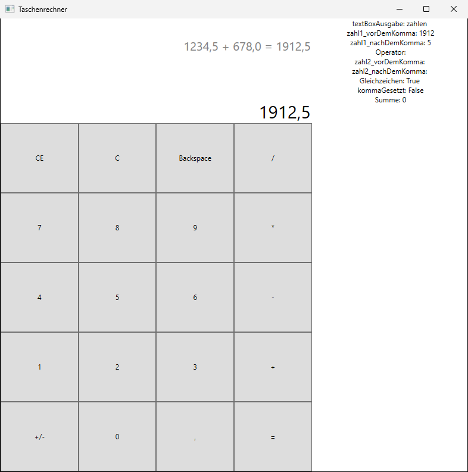
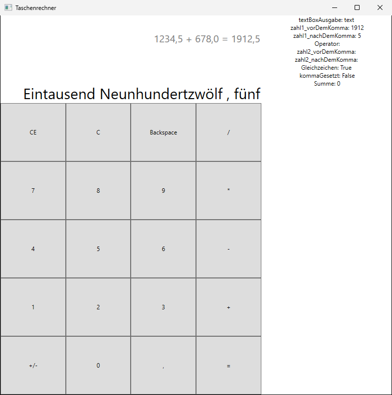

# Taschenrechner

Dieser Taschenrechner war **mein erstes Programmierprojekt**. Er entstand im April 2021 während eines Praktikums vor meiner Ausbildung zum Fachinformatiker für Anwendungsentwicklung.

Ich veröffentliche dieses Repo, um zu zeigen: Aller Anfang ist schwer und mühsam – und Programmieren ist etwas, das man lernen muss. Niemand schreibt von Anfang an sauberen Code.

| Ausgabe als Zahlen | Ausgabe als Text |
|---|---|
|  |  |

## Das Highlight: Zahlen in Worten

Auf dieses Feature bin ich bis heute stolz: Der Taschenrechner kann Eingaben und Ergebnisse statt in Ziffern **als ausgeschriebene deutsche Zahlwörter** anzeigen – aus `1912,5` wird „Eintausend Neunhundertzwölf, fünf“.

Dafür zerlegt das Programm die Zahl von rechts nach links in Dreiergruppen und setzt die Wörter nach den Regeln der deutschen Sprache zusammen:

- Einer, Zehner und Hunderter inklusive der Sonderfälle wie „elf“, „zwölf“, „siebzehn“ oder „zwanzig“
- die deutsche Reihenfolge „Einer **und** Zehner“ („vierunddreißig“)
- Tausender-Potenzen von Tausend über Millionen und Milliarden bis in den Billiarden-Bereich
- negative Zahlen („minus …“)
- Nachkommastellen, die Ziffer für Ziffer ausgegeben werden („, fünf“)

Mit meinem damals sehr begrenzten Programmierwissen war das eine echte Herausforderung – und es funktioniert.

## Features

- Grundrechenarten: Addition, Subtraktion, Multiplikation, Division
- Kommazahlen und Vorzeichenwechsel (`+/-`)
- Löschen mit `CE`, `C` und `Backspace`
- Verlauf der letzten Rechnung über dem Display
- Ausgabe wahlweise als Zahlen oder als Text (siehe oben)
- Einstellbare Nachkommastellen und Schriftgrößen über eine Konfigurationsdatei
- Debug-Ansicht im Fenster und Protokoll in eine Debug-Datei

## Originalzustand

Der Code ist bewusst so belassen, wie er damals entstanden ist – mit allen Ecken, Kanten und Bugs. Einzige spätere Änderung am Code: Die Pfade zur Konfigurations- und Debugdatei werden relativ zur `.exe` aufgelöst statt fest auf `E:\`, damit sich das Projekt heute noch starten lässt.

Außerdem wurde die Projektdatei auf das moderne SDK-Format umgestellt, damit sich das Projekt mit `dotnet run` starten lässt. Zielplattform ist weiterhin .NET Framework 4.7.2. Den unveränderten Originalstand gibt es unter dem Tag [`praktikum-2021`](https://github.com/FrederikHartung/Taschenrechner-Praktikum2/tree/praktikum-2021).

## Was ich heute anders machen würde

Mit dem Wissen aus Ausbildung und Beruf sehe ich heute vieles, was ich damals nicht wusste. Ein paar Beispiele:

- **Alles in einer Datei:** Rechenlogik, Anzeige, Konfiguration und Debugging stecken zusammen in `MainWindow.xaml.cs` (über 900 Zeilen). Heute würde ich die Rechenlogik in eigene Klassen auslagern und von der Oberfläche trennen, z. B. mit dem MVVM-Muster, das bei WPF üblich ist.
- **Zahlen als Strings:** Jede Zahl wird in zwei Strings „vor dem Komma“ und „nach dem Komma“ zerlegt und von Hand zusammengesetzt. Mit `decimal` und Formatierung wäre das deutlich einfacher und weniger fehleranfällig.
- **Verschachtelte if-Ketten:** Für jede Kombination aus Komma, Operator und Zahl gibt es einen eigenen Zweig, die Ausgabe für „Zahlen“ und „Text“ ist dabei fast vollständig doppelt geschrieben. Eine einzige Formatierungsfunktion würde reichen.
- **Wiederholter Code in der Zahlwort-Umwandlung:** Die Logik für Hunderter und Zehner kommt mehrfach fast identisch vor und gehört in eine eigene Methode.
- **Konfiguration über Zeilennummern:** Die Bedeutung einer Einstellung hängt an ihrer Zeile statt an ihrem Namen. Ein Format wie JSON oder die `App.config` wäre robuster.
- **Fest eingetragene Pfade:** Die Dateien lagen ursprünglich fest auf `E:\` – auf jedem anderen Rechner stürzte das Programm direkt ab.
- **Fehlerbehandlung:** Fehlt eine Zeile in der Konfiguration oder steht dort etwas Unerwartetes, stürzt die App ab, statt auf Standardwerte zurückzufallen.
- **Keine Tests:** Gerade die Zahlwort-Umwandlung wäre ideal für Unit-Tests gewesen.
- **Benennung:** Projekt und Solution hießen ursprünglich „Taschenrechner Praktikum Tag 2“ bzw. „Tag 4“ – das erzählte eher vom Praktikumsablauf als vom Inhalt. Die Dateien heißen inzwischen schlicht „Taschenrechner“, im Namespace `Taschenrechner_Praktikum_Tag_2` ist der alte Name aber bis heute erhalten.

## Projekt starten

**Voraussetzungen:** Windows und ein aktuelles [.NET SDK](https://dotnet.microsoft.com/download). Das .NET Framework 4.7.2, auf dem die App läuft, ist auf aktuellen Windows-Versionen bereits vorhanden.

### Mit dem .NET SDK

Im Repo-Ordner:

```powershell
dotnet run --project src
```

Die fertige Anwendung liegt danach unter `src\bin\Debug\Taschenrechner.exe`.

### Mit Visual Studio

1. Visual Studio mit dem Workload **„.NET-Desktopentwicklung“** installieren.
2. `Taschenrechner.sln` öffnen.
3. Mit **F5** starten.

## Konfiguration

Beim Start wird `config/Taschenrechner Konfiguration.txt` eingelesen. Die Bedeutung ergibt sich aus der **Zeilennummer**, der Wert steht jeweils hinter ` = `:

| Zeile | Option | Werte | Standard |
|---|---|---|---|
| 1 | `textBoxAusgabe` | `text` (Zahlen in Worten) oder `zahlen` | `zahlen` |
| 2 | `nachKommaStellen` | Anzahl Nachkommastellen | 4 |
| 3 | `fontSize_display` | Schriftgröße der Anzeige | 30 |
| 4 | `fontSize_verlauf` | Schriftgröße des Verlaufs | 20 |

Hinweise:
- Zeile 1 muss exakt `textBoxAusgabe = text` lauten, sonst wird `zahlen` verwendet.
- Die Datei muss alle vier Zeilen enthalten, und in Zeile 2 muss eine gültige Zahl stehen – sonst stürzt die App ab.

Eine Vorlage liegt unter `src/Muster Taschenrechner Konfiguration.txt`. Laufzeitausgaben schreibt die App nach `config/Taschenrechner Debug.txt`.

## Lizenz

© 2021 Frederik Hartung – alle Rechte vorbehalten. Der Code ist nur zur Ansicht veröffentlicht; jede Nutzung erfordert meine ausdrückliche Erlaubnis. Details siehe [LICENSE](LICENSE).
